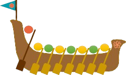
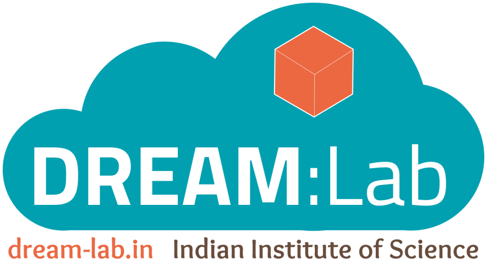
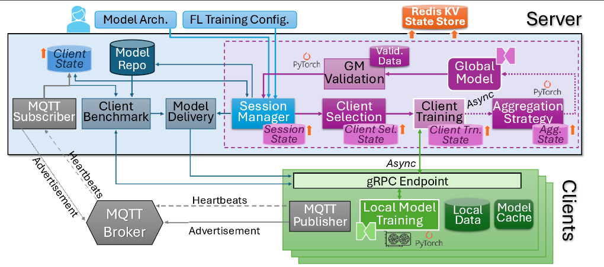

<h1 align="center">
   
</h1>

<p align="center">
  <strong>Flotilla: A Scalable, Modular and Resilient Federated Learning Framework for Heterogeneous Resources</strong>
</p>

<p align="center">
  <a href="https://dream-lab.in">
    
  </a>
  <a href="https://github.com/dream-lab/flotilla/blob/main/LICENSE">
    
  </a>
  
  <a href="https://github.com/dream-lab/flotilla">
    
  </a>
  <a href="https://github.com/dream-lab/flotilla/stargazers">
    
  </a>
</p>

Flotilla is a Python framework for federated learning that is designed to be extensible and easy to set up on a wide range of devices. It allows you to plug in your own client selection strategies, aggregation strategies, and models with minimal lines of code.

<br/>

<table width="100%">
  <tr>
    <td align="center">
      <br/>
      <h2>Welcome to Flotilla v1.0!</h2>
      <p><i>We've completely overhauled the framework with massive new features, improved modularity, and enhanced performance.</i></p>
      <br/>
      <a href="assets/markdown/v1.0.md">
        
      </a>
      <br/><br/>
    </td>
  </tr>
</table>

<br/>

## Credits
Flotilla has been developed at the [DREAM:Lab](https://dream-lab.in), [Indian Institute of Science, Bangalore](https://iisc.ac.in), in collaboration with [BITS Pilani-Hyderabad](https://www.bits-pilani.ac.in/hyderabad/manik-gupta/).

## Documentation

<table width="100%">
  <tr>
    <td align="center" width="33%" valign="top">
      <h3>User Guide</h3>
      <ul align="left">
        <li><i>Orchestrate distributed federated learning sessions.</i></li>
        <li><i>Deploy workloads across heterogeneous edge devices.</i></li>
      </ul>
      <br/>
      <a href="assets/markdown/user.md">
        
      </a>
      <br/><br/>
    </td>
    <td align="center" width="33%" valign="top">
      <h3>Integration Guide</h3>
      <ul align="left">
        <li><i>Integrate custom models and aggregation strategies.</i></li>
        <li><i>Extend capabilities with third-party framework plugins.</i></li>
      </ul>
      <br/>
      <a href="assets/markdown/integration.md">
        
      </a>
      <br/><br/>
    </td>
    <td align="center" width="33%" valign="top">
      <h3>Developer Guide</h3>
      <ul align="left">
        <li><i>Explore the core system architecture and gRPC APIs.</i></li>
        <li><i>Review comprehensive guidelines for contributing.</i></li>
      </ul>
      <br/>
      <a href="assets/markdown/developer.md">
        
      </a>
      <br/><br/>
    </td>
  </tr>
  <tr>
    <td align="center" colspan="3" valign="top">
      <br/><br/>
      <h3>Core Strategies Implemented</h3>
      <br/>
      <a href="assets/markdown/strategies.md">
        
      </a>
      <br/><br/>
    </td>
  </tr>
</table>

<br/>

## Features

* **Extensibility:** Flotilla is designed to be extensible, so you can easily add your own custom components, such as:

    * Client selection strategies: These strategies determine which clients will participate in each round of training.
    * Aggregation strategies: These strategies combine the model updates from the clients into a single update for the global model.
    * **Session termination conditions:** Custom logic to decide when to stop training (e.g. after a fixed number of rounds, when validation loss converges, when a target accuracy is reached, or your own criteria). See [Custom session termination](#custom-session-termination) below.
    * Models: Flotilla supports models built with **PyTorch**, **TensorFlow/Keras**, **JAX**, **Scikit-Learn**, or **ONNX Runtime**, so you can use the right framework for each task.

* **Ease of use:** Flotilla is easy to set up and use, even if you are new to federated learning. It provides a simple API for training and evaluating models, and it comes with a variety of example applications.

* **Portability:** Flotilla can be run on a wide range of devices, from Raspberry Pis to GPU workstations. This makes it ideal for a variety of use cases, such as training models on mobile devices or on edge devices. It can also be run in a Dockerized environment with the server and clients running as containers.


## Design


Flotilla consists of a leader and a set of clients. The *leader* runs on a central server or a cloud VM while the *clients* run on various edge devices or machines hosting local training data. Clients advertise their availablity for FL training, their resource capacity and dataset details through an MQTT topic. When a user starts a FL session, they pass the model file and configuration to the leader. The leader selects clients for the first round of training based on the configured client selection strategy, and ships the models to the clients (if required). One round of training occurs at the clients. If using a sync FL strategy, aggregation happens at the leader after all clients report their local model to it, and the configured aggregation strategy is performed to get the global model. Another round of client selection by the leader and local training at those clients then occurs. This repeats for a certain number of training rounds or a quality threshold is reached, before the session stops at the leader. Clients are stateless and only require the local training data, Flotilla client scripts and model training framework (PyTorch, TensorFlow, JAX, Scikit-Learn, or ONNX Runtime, depending on the model) to be present. The leader is stateful and persists the session state to a local file for checkpointing or to a Redis store.

## License and Copyright

This project is open-sourced under the **[Apache License, Version 2.0](https://www.apache.org/licenses/LICENSE-2.0.txt)**.

<br/>

> &copy; **2023 DREAM:Lab, Indian Institute of Science.** *All rights reserved.*


## Citation

If you use Flotilla in your research or projects, please consider citing our paper:

> **Flotilla: A Scalable, Modular and Resilient Federated Learning Framework for Heterogeneous Resources**  
> *Roopkatha Banerjee, Prince Modi, Jinal Vyas, Chunduru Sri Abhijit, Tejus Chandrashekar, Harsha Varun Marisetty, Manik Gupta, and Yogesh Simmhan.*  
> Journal of Parallel and Distributed Computing (JPDC), Volume 203, September 2025, Elsevier.
> 
> <a href="https://doi.org/10.1016/j.jpdc.2025.105103"></a>
> <a href="https://arxiv.org/abs/2507.02295"></a>

<br/>

### 

```bibtex
@article{banerjee2025flotilla,
  title     = {Flotilla: A Scalable, Modular and Resilient Federated Learning Framework for Heterogeneous Resources},
  author    = {Banerjee, Roopkatha and Modi, Prince and Vyas, Jinal and Abhijit, Chunduru Sri and Chandrashekar, Tejus and Marisetty, Harsha Varun and Gupta, Manik and Simmhan, Yogesh},
  journal   = {Journal of Parallel and Distributed Computing},
  volume    = {203},
  pages     = {105103},
  year      = {2025},
  publisher = {Elsevier},
  doi       = {10.1016/j.jpdc.2025.105103}
}
```
